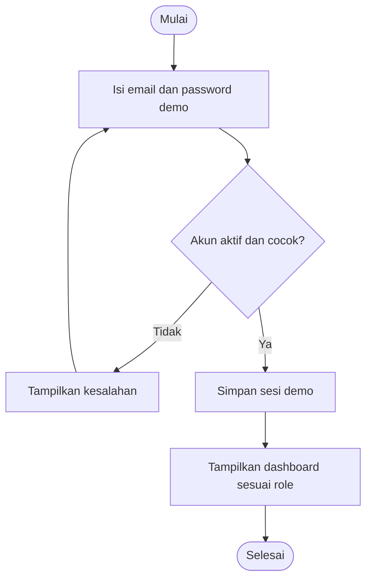
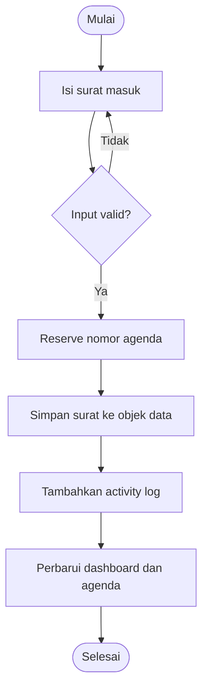
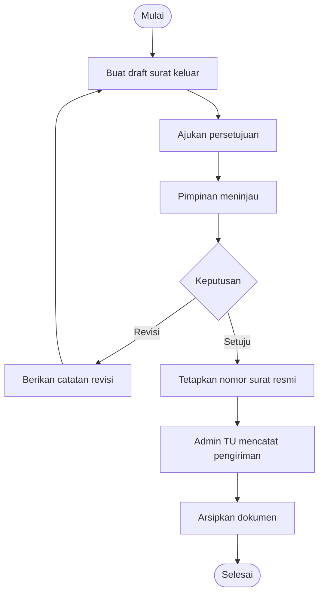
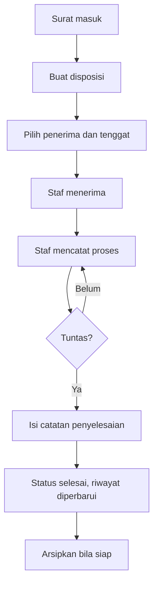
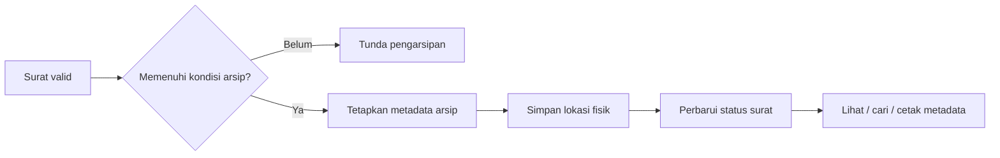

# Activity Diagram

## 1. Login

```mermaid
flowchart TD
 A([Mulai]) --> B[Isi email dan password demo]
 B --> C{Akun aktif dan cocok?}
 C -- Tidak --> D[Tampilkan kesalahan] --> B
 C -- Ya --> E[Simpan sesi demo]
 E --> F[Tampilkan dashboard sesuai role] --> G([Selesai])
```

## 2. Pencatatan surat masuk

```mermaid
flowchart TD
 A([Mulai]) --> B[Isi surat masuk]
 B --> C{Input valid?}
 C -- Tidak --> B
 C -- Ya --> D[Reserve nomor agenda]
 D --> E[Simpan surat ke objek data]
 E --> F[Tambahkan activity log]
 F --> G[Perbarui dashboard dan agenda] --> H([Selesai])
```

## 3. Pembuatan surat keluar dan persetujuan

```mermaid
flowchart TD
 A([Mulai]) --> B[Buat draft surat keluar]
 B --> C[Ajukan persetujuan]
 C --> D[Pimpinan meninjau]
 D --> E{Keputusan}
 E -- Revisi --> F[Berikan catatan revisi] --> B
 E -- Setuju --> G[Tetapkan nomor surat resmi]
 G --> H[Admin TU mencatat pengiriman]
 H --> I[Arsipkan dokumen] --> J([Selesai])
```

## 4. Disposisi dan tindak lanjut

```mermaid
flowchart TD
 A[Surat masuk] --> B[Buat disposisi]
 B --> C[Pilih penerima dan tenggat]
 C --> D[Staf menerima]
 D --> E[Staf mencatat proses]
 E --> F{Tuntas?}
 F -- Belum --> E
 F -- Ya --> G[Isi catatan penyelesaian]
 G --> H[Status selesai, riwayat diperbarui]
 H --> I[Arsipkan bila siap]
```

## 5. Pengarsipan

```mermaid
flowchart LR
 A[Surat valid] --> B{Memenuhi kondisi arsip?}
 B -- Belum --> C[Tunda pengarsipan]
 B -- Ya --> D[Tetapkan metadata arsip]
 D --> E[Simpan lokasi fisik]
 E --> F[Perbarui status surat]
 F --> G[Lihat / cari / cetak metadata]
```
