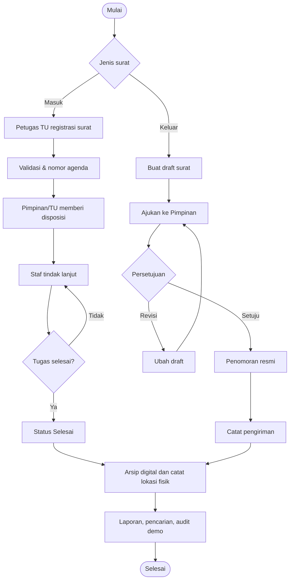

# Flowchart Operasional Administrasi Surat

```mermaid
flowchart TD
 A([Mulai]) --> B{Jenis surat}
 B -- Masuk --> C[Petugas TU registrasi surat]
 C --> D[Validasi & nomor agenda]
 D --> E[Pimpinan/TU memberi disposisi]
 E --> F[Staf tindak lanjut]
 F --> G{Tugas selesai?}
 G -- Tidak --> F
 G -- Ya --> H[Status Selesai]
 H --> I[Arsip digital dan catat lokasi fisik]
 B -- Keluar --> J[Buat draft surat]
 J --> K[Ajukan ke Pimpinan]
 K --> L{Persetujuan}
 L -- Revisi --> M[Ubah draft] --> K
 L -- Setuju --> N[Penomoran resmi]
 N --> O[Catat pengiriman]
 O --> I
 I --> P[Laporan, pencarian, audit demo]
 P --> Q([Selesai])
```
