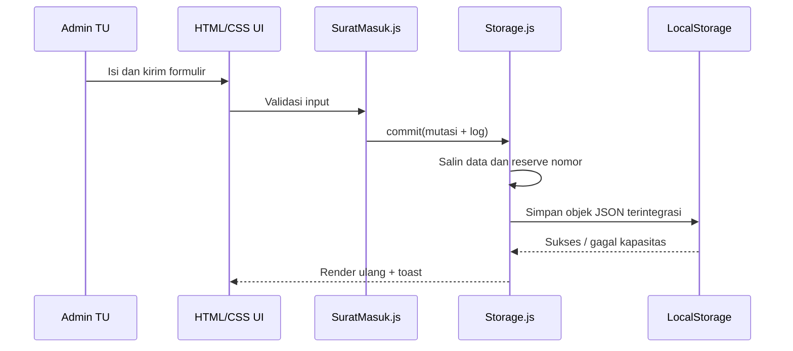
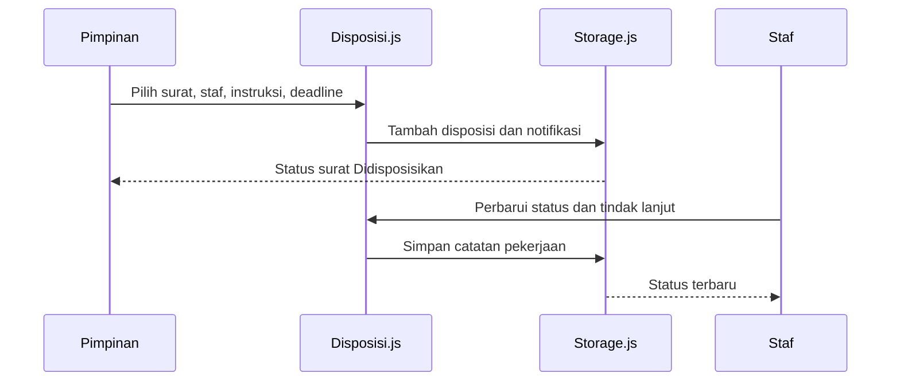
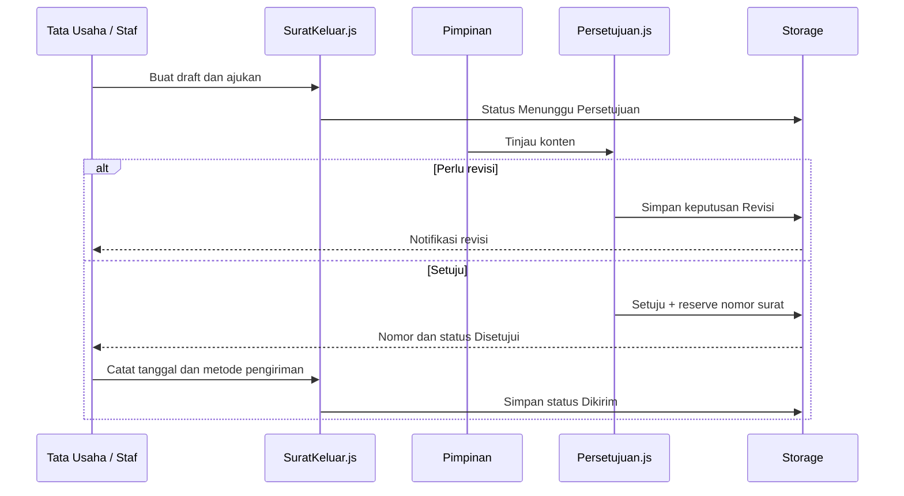
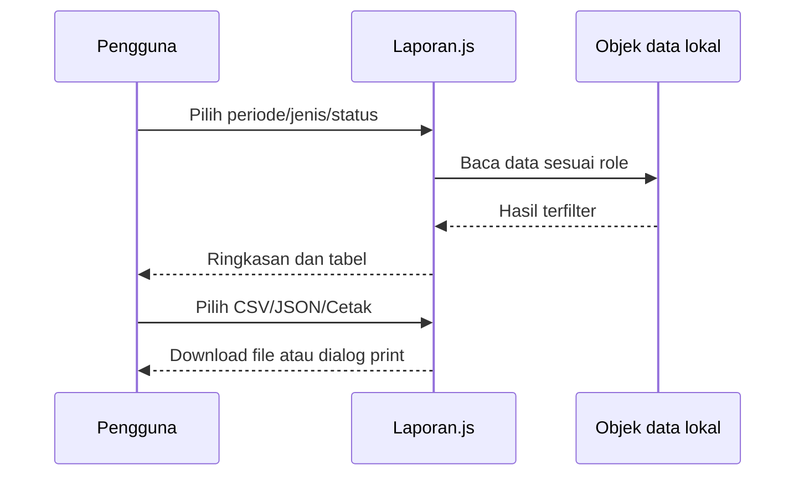

# Sequence Diagram

## Surat masuk

```mermaid
sequenceDiagram
 participant U as Admin TU
 participant UI as HTML/CSS UI
 participant JS as SuratMasuk.js
 participant ST as Storage.js
 participant LS as LocalStorage
 U->>UI: Isi dan kirim formulir
 UI->>JS: Validasi input
 JS->>ST: commit(mutasi + log)
 ST->>ST: Salin data dan reserve nomor
 ST->>LS: Simpan objek JSON terintegrasi
 LS-->>ST: Sukses / gagal kapasitas
 ST-->>UI: Render ulang + toast
```

## Disposisi

```mermaid
sequenceDiagram
 participant P as Pimpinan
 participant JS as Disposisi.js
 participant ST as Storage.js
 participant S as Staf
 P->>JS: Pilih surat, staf, instruksi, deadline
 JS->>ST: Tambah disposisi dan notifikasi
 ST-->>P: Status surat Didisposisikan
 S->>JS: Perbarui status dan tindak lanjut
 JS->>ST: Simpan catatan pekerjaan
 ST-->>S: Status terbaru
```

## Persetujuan surat keluar

```mermaid
sequenceDiagram
 participant TU as Tata Usaha / Staf
 participant OUT as SuratKeluar.js
 participant P as Pimpinan
 participant APP as Persetujuan.js
 participant ST as Storage
 TU->>OUT: Buat draft dan ajukan
 OUT->>ST: Status Menunggu Persetujuan
 P->>APP: Tinjau konten
 alt Perlu revisi
 APP->>ST: Simpan keputusan Revisi
 ST-->>TU: Notifikasi revisi
 else Setuju
 APP->>ST: Setuju + reserve nomor surat
 ST-->>TU: Nomor dan status Disetujui
 TU->>OUT: Catat tanggal dan metode pengiriman
 OUT->>ST: Simpan status Dikirim
 end
```

## Laporan

```mermaid
sequenceDiagram
 participant U as Pengguna
 participant UI as Laporan.js
 participant ST as Objek data lokal
 U->>UI: Pilih periode/jenis/status
 UI->>ST: Baca data sesuai role
 ST-->>UI: Hasil terfilter
 UI-->>U: Ringkasan dan tabel
 U->>UI: Pilih CSV/JSON/Cetak
 UI-->>U: Download file atau dialog print
```
